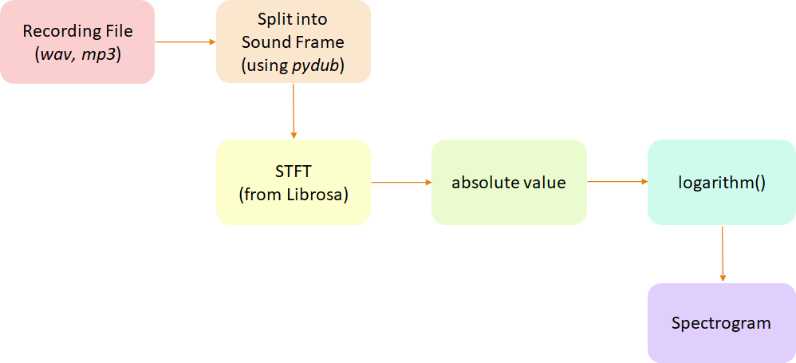

# Sound Analysis

By Sophie Shin

## Introduction Analysis Step


## Install the dependencies
```sh
pip3 install -r requirements.txt
sudo apt-get install ffmpeg
```
or
```sh
sudo bash env.sh
```

## Usage

## Step0. Convert .amr(or others) file into .wav
*Method 1* Only Convert file extension
```sh
ffmpeg -i sound3.amr -ar 22050 sound3.wav
```

*Method 2* Convert file extension and edit particular seconds of Audio
```sh
python3 editAudio.py -r <beginSec>:<endSec> -i <inputAudioFile> -o <outputAudioFile>
```
Take this command as an example,
```sh
python3 editAudio.py -r 5:20 -i soundfile/0601/30s/sound1.wav -o s.wav
```

## Step1. Split Frame from a wave file
It will split frames automatically when it detects the sound. <br>
Detection standard: dBFS > -15 (max dBFS is 0), and trim sound interval = [sec-50, sec+50]
```sh
python3 editAudio.py -a -i <inputAudioFile> -o <outputAudioPath>
```

Take this command as an example,
```sh
python3 editAudio.py -a -i soundfile/0601/30s/sound1.wav -p soundfile/0601/frame
```

## Step2. Create Spectrogram by particular Fourier Transform Method
* Create Spectrogram
```sh
python3 spectrogram.py -T <Transform> -i <inputAudioPath> -o <saveImagePath>
```
Take this command as an example,
```sh
python3 spectrogram.py -T stft -i soundfile/0601/frame -o img/correct
```
Output
```
Input File ：  sound/
Output Path：  img/stft/

STFT Spectrogram Has Created!
```

## Step3. CNN Training
```sh
python3 cnn.py -i <inputImageBasePath>
```
Take this command as an example,
```sh
python3 cnn.py -i ./real_training_data/
```